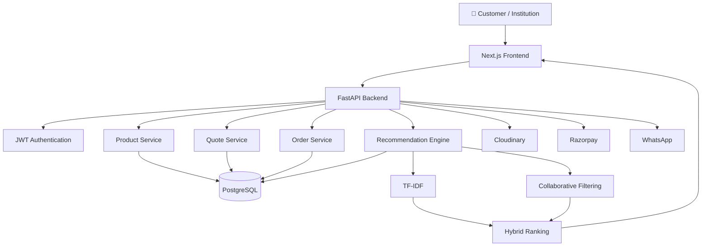
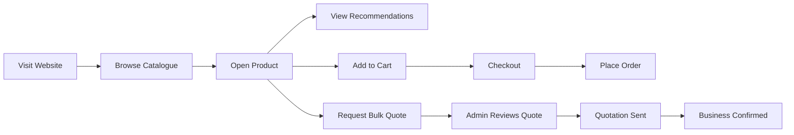
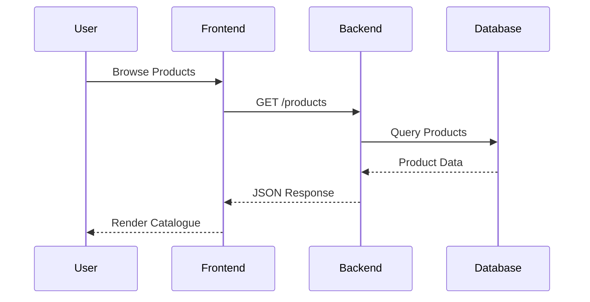
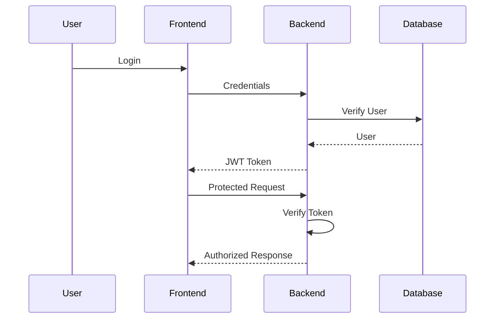
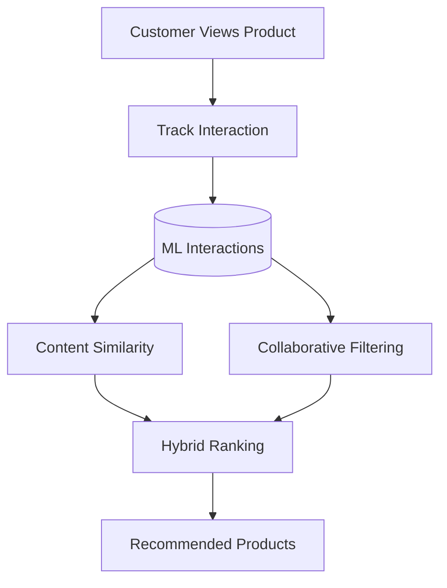
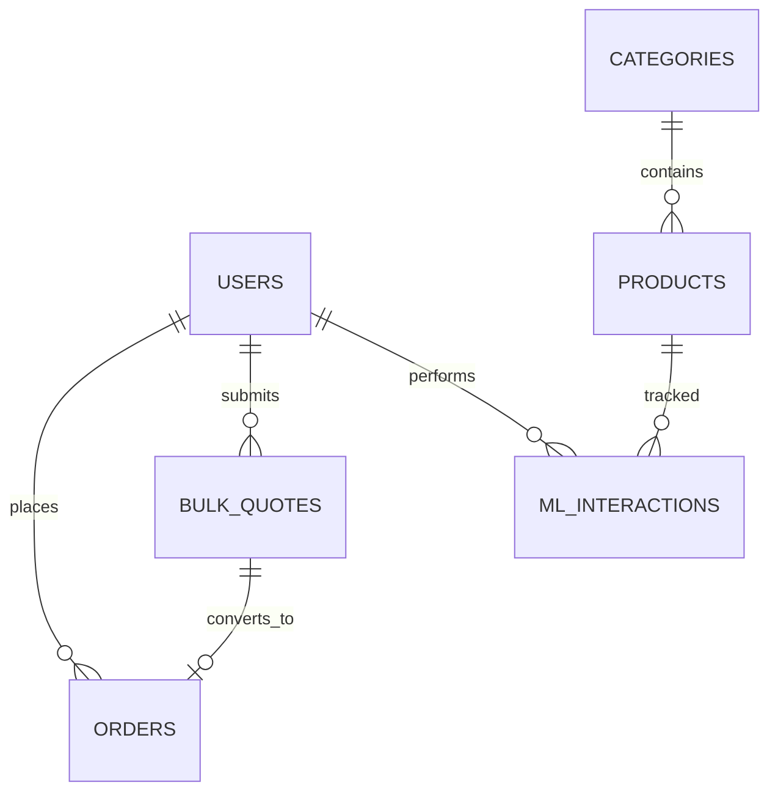
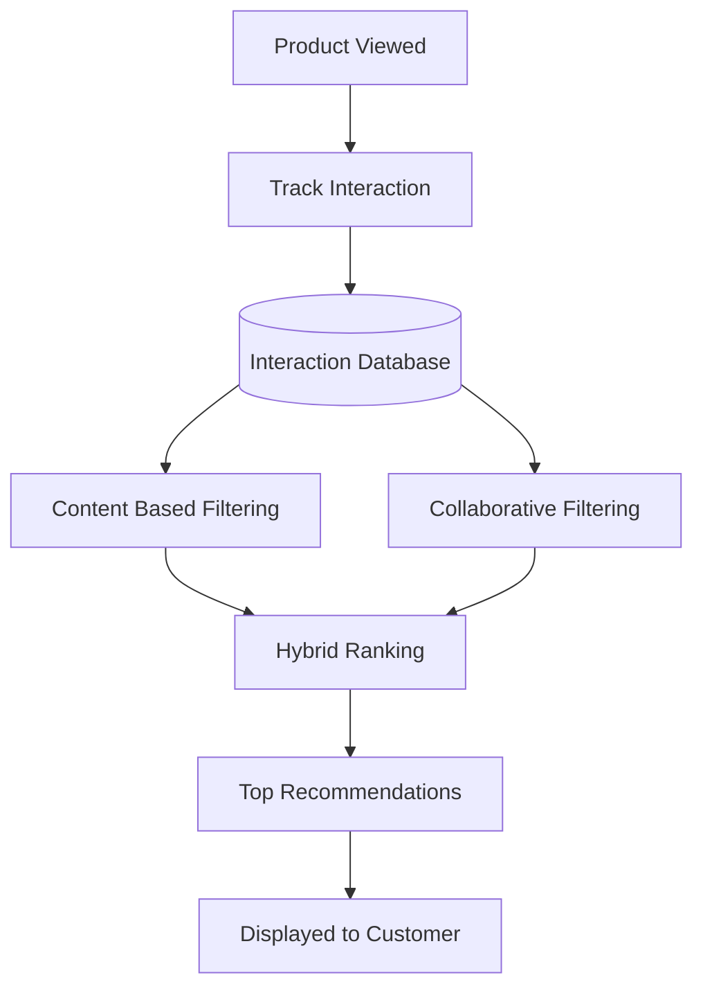
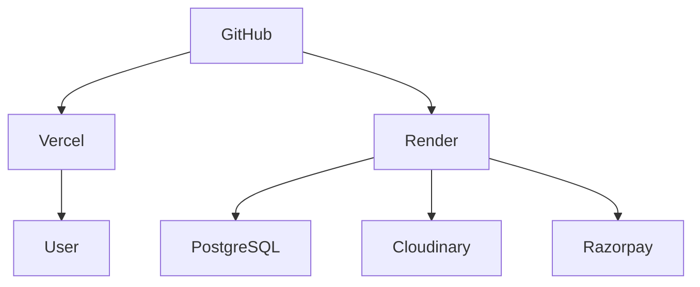

<div align="center">

# 🏥 Shaukin Garments

### Modern B2B Commerce Platform for Institutional Uniform Procurement

<p align="center">
A production-ready full-stack commerce platform built to digitize institutional uniform procurement through intelligent product discovery, streamlined bulk quotation workflows, and a cloud-native architecture.
</p>

<p align="center">

[](https://shaukin-garments.vercel.app)
[](https://shaukin-garments.onrender.com/docs)
[](https://nextjs.org)
[](https://fastapi.tiangolo.com)
[](https://supabase.com)
[](LICENSE)

</p>

</div>

---

# ✨ Introduction

Shaukin Garments is a **production-grade B2B and retail e-commerce platform** designed specifically for institutional uniform suppliers.

Rather than adapting a generic online store for business procurement, the platform reimagines how organizations purchase uniforms, linens, and workwear at scale. Hospitals, schools, industries, petrol pumps, and corporate offices can browse products, submit detailed bulk quotations, and manage procurement through a streamlined digital workflow.

Built with a modern asynchronous backend, cloud-native deployment, and an intelligent recommendation engine, the platform transforms a traditionally manual ordering process into a scalable digital experience.

---

# 💡 Why Shaukin?

This project wasn't created as a portfolio exercise.

It originated from a real business challenge.

A family-run institutional garment business handled quotations, orders, and customer communication almost entirely through WhatsApp conversations, phone calls, and spreadsheets. As the business expanded, managing hundreds of products, bulk inquiries, pricing discussions, and inventory manually became increasingly difficult.

Instead of choosing a generic e-commerce solution, Shaukin Garments was built from the ground up around **institutional procurement workflows**, combining retail commerce with business-specific features such as quotation management, dual pricing, inventory administration, and intelligent product recommendations.

The result is a platform that not only serves customers more efficiently but also simplifies operations for the business itself.

---

# 🚀 What Makes Shaukin Different?

<table>

<tr>

<td width="50%">

## 🏢 Built Around Procurement

Designed for organizations—not just shoppers.

Institutional buyers can request quotations for multiple products, specify quantity distributions, include delivery information, and communicate custom requirements through a workflow tailored specifically for bulk purchasing.

</td>

<td width="50%">

## 🤖 Intelligent Product Discovery

Instead of static "related products", recommendations adapt based on product similarity and customer behaviour.

A hybrid recommendation engine combines content understanding with interaction history to surface products that are genuinely relevant.

</td>

</tr>

<tr>

<td>

## ⚡ Modern Backend

A fully asynchronous REST API powers the platform with secure authentication, role-based access control, scalable database interactions, and cloud-native deployment.

</td>

<td>

## ☁ Cloud Ready

The application is deployed across modern cloud services with automatic deployments, managed PostgreSQL, CDN-powered media delivery, and production-ready infrastructure.

</td>

</tr>

</table>

---

# 🌟 Core Capabilities

<div align="center">

| 🛍 Commerce | 🏢 Procurement |
|:-----------:|:-------------:|
| Product Catalogue | Multi-item Quotations |
| Smart Search & Filters | Bulk Pricing |
| Shopping Cart | MOQ Support |
| Secure Checkout | Delivery Details |
| Product Variants | Organization Information |
| Responsive UI | WhatsApp Integration |

</div>

<br>

<div align="center">

| ⚙ Administration | 🤖 Intelligence |
|:----------------:|:---------------:|
| Product Management | Hybrid Recommendation Engine |
| Inventory Control | TF-IDF Similarity |
| Quote Dashboard | Collaborative Filtering |
| Order Management | Behaviour Tracking |
| User Roles | Trending Products |
| Media Uploads | Frequently Bought Together |

</div>

---

# 📸 Product Tour

A quick walkthrough of the application.

## 🏠 Landing Experience

The homepage introduces institutional buyers to the platform through sector-based navigation, featured collections, and clear calls-to-action for both retail customers and bulk buyers.


---

## 🛍 Explore the Catalogue

Browse products using category filters, search, and bulk availability options.


---

## 📦 Product Details

Each product page provides detailed specifications, pricing for both retail and institutional purchases, stock information, image galleries, and intelligent recommendations.


---

## 🛒 Shopping Cart

Persistent shopping cart with quantity controls, automatic GST calculation, and seamless checkout.


---

## 🏢 Institutional Quotation Workflow

Organizations can request quotations containing multiple products, quantity breakdowns, delivery information, and custom requirements through a dedicated procurement workflow.


---

## ⚙ Administrative Dashboard

Administrators manage inventory, products, quotations, customer requests, and operational workflows from a centralized dashboard.


---

## 🤖 Intelligent Recommendations

The recommendation engine continuously learns from customer interactions to provide relevant product suggestions across the catalogue.


---

## 📚 Interactive API Documentation

Every endpoint is documented automatically through FastAPI's OpenAPI integration.


---

# 🏗 System Architecture



---

# 🔄 Customer Journey



---

# ⚡ At a Glance

| | |
|---|---|
| **Frontend** | Next.js 14 + TypeScript |
| **Backend** | FastAPI |
| **Database** | PostgreSQL (Supabase) |
| **Authentication** | JWT |
| **State Management** | Zustand + TanStack Query |
| **Machine Learning** | TF-IDF + Collaborative Filtering |
| **Media Storage** | Cloudinary |
| **Deployment** | Vercel + Render |

---
# ⚙ Technology Stack

The platform follows a modern cloud-native architecture with a clear separation between the presentation layer, business logic, data layer, and machine learning components.

<div align="center">

| Frontend | Backend | Database | AI / ML |
|:---------:|:-------:|:--------:|:-------:|
| Next.js 14 | FastAPI | PostgreSQL | scikit-learn |
| TypeScript | Python 3.11 | Supabase | TF-IDF |
| Tailwind CSS | SQLAlchemy Async | AsyncPG | Cosine Similarity |
| Zustand | Pydantic | JSONB | Collaborative Filtering |
| TanStack Query | JWT | UUID | Hybrid Ranking |

</div>

<br>

<div align="center">

| DevOps | Cloud Services |
|:-------:|:--------------:|
| Git & GitHub | Vercel |
| Render | Cloudinary |
| OpenAPI | Razorpay |

</div>

---

# 📂 Project Structure

The repository is organized into independent frontend and backend applications, making development, deployment, and maintenance significantly easier.

```text
shaukin-garments/

├── backend/
│   ├── app/
│   │   ├── core/
│   │   ├── db/
│   │   ├── ml/
│   │   ├── models/
│   │   ├── routers/
│   │   ├── schemas/
│   │   └── services/
│   │
│   ├── requirements.txt
│   ├── schema.sql
│   └── main.py
│
├── frontend/
│   ├── app/
│   ├── components/
│   ├── hooks/
│   ├── lib/
│   ├── store/
│   └── public/
│
├── assets/
│
├── docs/
│
├── README.md
│
└── LICENSE
```

---

# 🚀 Getting Started

## Prerequisites

Make sure the following are installed on your machine.

- Node.js 18+
- Python 3.11+
- PostgreSQL (or Supabase)
- Git

---

# 1️⃣ Clone the Repository

```bash
git clone https://github.com/dishi575/shaukin-garments.git

cd shaukin-garments
```

---

# 2️⃣ Backend Setup

Create a virtual environment.

```bash
cd backend

python -m venv venv
```

Activate it.

Windows

```bash
venv\Scripts\activate
```

Linux / macOS

```bash
source venv/bin/activate
```

Install dependencies.

```bash
pip install -r requirements.txt
```

Create the environment file.

```bash
cp .env.example .env
```

Import the database schema.

```bash
psql DATABASE_URL -f schema.sql
```

Start the backend.

```bash
uvicorn main:app --reload
```

Backend

```
http://localhost:8000
```

Swagger

```
http://localhost:8000/docs
```

---

# 3️⃣ Frontend Setup

Install dependencies.

```bash
cd frontend

npm install
```

Create

```text
.env.local
```

Run

```bash
npm run dev
```

Frontend

```
http://localhost:3000
```

---

# 🔐 Environment Variables

## Backend

| Variable | Description |
|-----------|-------------|
| DATABASE_URL | PostgreSQL connection |
| SECRET_KEY | JWT signing key |
| ALGORITHM | JWT algorithm |
| ACCESS_TOKEN_EXPIRE_MINUTES | Token expiry |
| CLOUDINARY_CLOUD_NAME | Cloudinary account |
| CLOUDINARY_API_KEY | API Key |
| CLOUDINARY_API_SECRET | API Secret |
| RAZORPAY_KEY_ID | Payment gateway |
| RAZORPAY_KEY_SECRET | Payment gateway |

---

## Frontend

| Variable | Description |
|-----------|-------------|
| NEXT_PUBLIC_API_URL | Backend URL |
| NEXT_PUBLIC_RAZORPAY_KEY | Razorpay Public Key |

---

# 📡 REST API Overview

The backend exposes a RESTful API built with FastAPI.

Every endpoint is documented automatically through OpenAPI and can be explored interactively using Swagger.

---

## Authentication

| Method | Endpoint | Description |
|----------|----------|-------------|
| POST | `/api/auth/register` | Create account |
| POST | `/api/auth/login` | Login |
| GET | `/api/auth/me` | Current user |

---

## Products

| Method | Endpoint |
|----------|----------|
| GET | `/api/products` |
| GET | `/api/products/{slug}` |
| POST | `/api/products` |
| PATCH | `/api/products/{id}` |
| DELETE | `/api/products/{id}` |

---

## Quotations

| Method | Endpoint |
|----------|----------|
| POST | `/api/quotes` |
| GET | `/api/quotes` |
| PATCH | `/api/quotes/{id}` |

---

## Orders

| Method | Endpoint |
|----------|----------|
| POST | `/api/orders` |
| GET | `/api/orders/my` |

---

## Recommendations

| Method | Endpoint |
|----------|----------|
| POST | `/api/recommendations/track` |
| GET | `/api/recommendations/product/{id}` |
| GET | `/api/recommendations/home` |

---

# 🔄 Request Lifecycle

Every interaction follows a predictable flow through the application.



---

# 🔐 Authentication Flow

Role-based authentication is implemented using JWT.



---

# 📁 Application Modules

<div align="center">

| Module | Responsibility |
|:------:|---------------|
| 🛍 Catalogue | Product browsing and filtering |
| 📦 Products | Inventory & product information |
| 🛒 Cart | Shopping experience |
| 🏢 Bulk Quotes | Institutional procurement |
| ⚙ Admin | Product & quotation management |
| 🔐 Auth | User authentication |
| 🤖 Recommendation Engine | Intelligent product suggestions |

</div>

---

# 🧠 Recommendation Pipeline

Every customer interaction contributes to future recommendations.



---
# 🗄 Database Design

The application is powered by PostgreSQL with a relational schema designed to support both retail commerce and institutional procurement workflows.



---

## Core Tables

| Table | Purpose |
|---------|---------|
| **Users** | Customer accounts, authentication and roles |
| **Products** | Product catalogue and inventory |
| **Categories** | Product categorization |
| **Orders** | Retail purchases |
| **Bulk Quotes** | Institutional procurement requests |
| **ML Interactions** | Behaviour tracking for recommendations |

---

# 🤖 Recommendation Engine

Rather than displaying static "Related Products", Shaukin continuously learns from customer interactions to surface more relevant recommendations.

The recommendation engine combines two independent techniques into a hybrid ranking system.

- Content Similarity (TF-IDF)
- Collaborative Filtering
- Behaviour Tracking
- Hybrid Ranking

---

## Recommendation Workflow



---

# 🚀 Deployment Architecture

The platform is deployed as independent frontend and backend applications with managed cloud services.



---

## Production Stack

| Layer | Platform |
|--------|----------|
| Frontend | Vercel |
| Backend | Render |
| Database | Supabase PostgreSQL |
| Image Storage | Cloudinary |
| Payments | Razorpay |
| Version Control | GitHub |

---

# 📦 Deployment

The application is designed around independent deployments.

### Frontend

```bash
npm run build
```

Deploy to

- Vercel

---

### Backend

```bash
uvicorn main:app
```

Deploy to

- Render

---

### Database

Hosted using

- Supabase PostgreSQL

---

### Images

Uploaded directly to

- Cloudinary

---

# 🛣 Roadmap

## ✅ Completed

- [x] Full Stack E-Commerce Platform
- [x] Institutional Procurement Workflow
- [x] Product Catalogue
- [x] Authentication
- [x] Shopping Cart
- [x] Admin Dashboard
- [x] Cloud Image Upload
- [x] Recommendation Engine
- [x] Production Deployment

---

## 🚧 Currently Improving

- [ ] Mobile UI Refinements
- [ ] SEO Improvements
- [ ] Performance Optimization
- [ ] Analytics Dashboard

---

## 💡 Future Ideas

- [ ] WhatsApp Business API
- [ ] Email Notifications
- [ ] Inventory Forecasting
- [ ] Demand Prediction
- [ ] Customer Analytics
- [ ] PWA Support
- [ ] Multi-vendor Marketplace
- [ ] AI-powered Procurement Assistant

---

# 🤝 Contributing

Contributions are welcome.

If you'd like to improve the project:

1. Fork the repository

2. Create a feature branch

```bash
git checkout -b feature/new-feature
```

3. Commit changes

```bash
git commit -m "Add new feature"
```

4. Push

```bash
git push origin feature/new-feature
```

5. Open a Pull Request

---

# 📚 Documentation

Additional technical documentation is available in the **docs/** directory.

| Document | Description |
|-----------|-------------|
| architecture.md | System architecture |
| api.md | REST API reference |
| database.md | Database schema |
| recommendation-engine.md | Recommendation system |
| deployment.md | Deployment guide |
| engineering-decisions.md | Design decisions |

---

# 💻 Future Engineering Improvements

Some areas planned for future iterations include:

- Redis caching
- Background workers
- Elasticsearch product search
- Docker Compose
- CI/CD pipelines
- Kubernetes deployment
- CDN optimization
- Horizontal scaling

---

# 👩‍💻 Author

<div align="center">

## Dishita Chaturvedi

Computer Science Engineering Student

AI • Machine Learning • Full Stack Development

[](https://github.com/dishi575)

[](YOUR_LINKEDIN)

[](mailto:dishitachaturvedi2005@gmail.com)

</div>

---

# 📄 License

Distributed under the MIT License.

See the **LICENSE** file for more information.

---

<div align="center">

## ⭐ If you found this project interesting, consider giving it a star!

### Built to solve a real business problem.
### Engineered as a modern cloud-native application.


**Shaukin Garments**

*Modern Institutional Commerce Platform*

</div>
