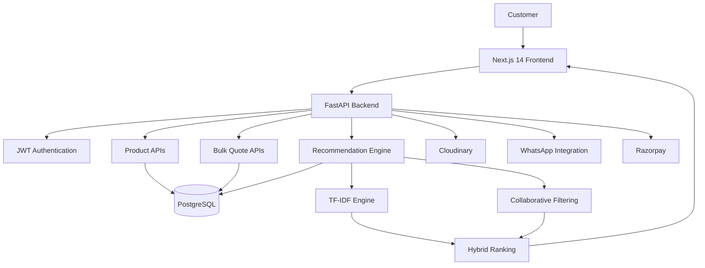
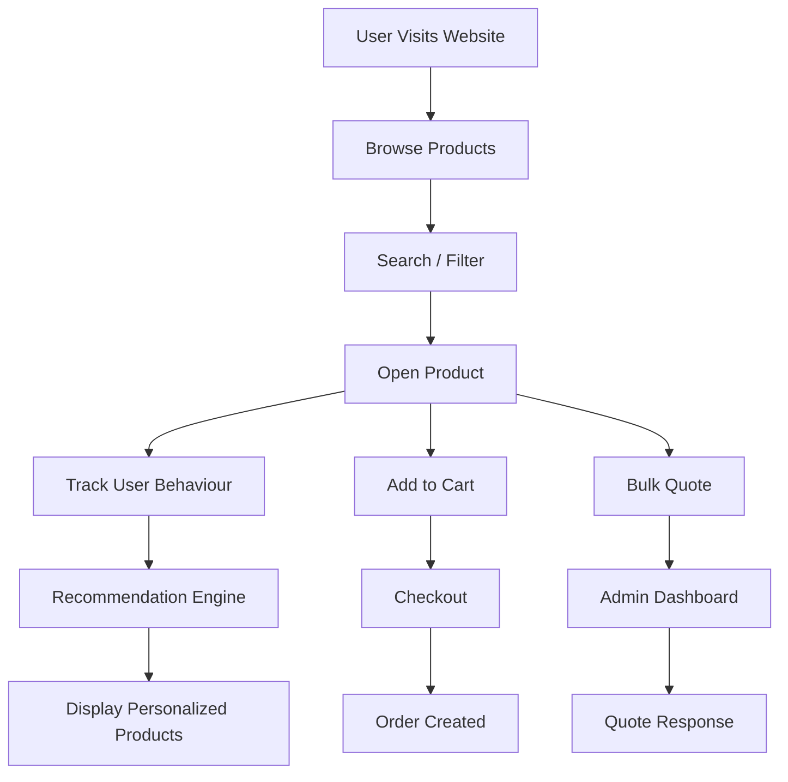

# 🏥 Shaukin Garments

### Production-Grade B2B & Retail E-Commerce Platform for Institutional Uniforms & Linens

*Digitising institutional uniform procurement through modern cloud-native architecture, intelligent product recommendations, and seamless B2B workflows.*

---

### ⭐ Highlights

🚀 Production Deployment

🛍️ Full Stack Commerce Platform

🏥 Built for a Real Business

🤖 Hybrid ML Recommendation Engine

⚡ Async FastAPI Backend

🔐 JWT Authentication

☁️ Cloud Native Deployment

📦 PostgreSQL + SQLAlchemy

📱 Responsive UI

---

### 🔗 Links

| Resource | Link |
|-----------|------|
| 🌐 Live Website | https://shaukin-garments.vercel.app |
| 📚 Swagger API | https://shaukin-garments.onrender.com/docs |
| 🎥 Demo Video | *Coming Soon* |
| 📖 Documentation | docs/ |
| 🧠 ML Documentation | docs/recommendation-engine.md |

---

# 📖 Table of Contents

- Project Overview
- Why This Project?
- Problem Statement
- Solution
- Features
- Screenshots
- System Architecture
- Workflow
- Tech Stack
- Folder Structure
- Installation
- Environment Variables
- API Documentation
- Database Design
- Recommendation Engine
- Engineering Decisions
- Technical Challenges
- Performance
- Security
- Deployment
- Roadmap
- Known Limitations
- Contributing
- Author
- License

---

# 🎯 Project Overview

Shaukin Garments is a **production-ready full-stack B2B and retail e-commerce platform** designed specifically for institutional uniform procurement.

Unlike conventional e-commerce websites that primarily focus on retail customers, this platform addresses the operational challenges faced by hospitals, schools, industrial organizations, petrol pumps, corporate offices, and institutional buyers who purchase uniforms and linens in bulk.

The platform combines modern cloud-native technologies with intelligent recommendation systems to digitize a traditionally manual procurement workflow.

---

## Who is it for?

### 🏥 Hospitals

- Doctor Coats
- OT Drapes
- Scrub Suits
- Nurse Uniforms
- Patient Gowns
- Bed Linens

---

### 🏫 Schools

- School Uniforms
- Blazers
- House T-Shirts
- Sports Uniforms

---

### 🏭 Industries

- Safety Uniforms
- Industrial Wear
- Reflective Jackets
- Worker Uniforms

---

### 🏢 Corporate Offices

- Staff Uniforms
- Reception Uniforms
- Corporate Shirts
- Sarees

---

### 👤 Retail Customers

- Individual purchases
- Cart & Checkout
- Secure Authentication

---

# ❤️ Why This Project?

This project wasn't built as a portfolio exercise.

It was built to solve a **real operational problem**.

My father's institutional uniform business handled every customer interaction through WhatsApp calls, spreadsheets, and manual negotiations.

That resulted in:

- No searchable product catalogue
- No inventory visibility
- No online ordering
- No quotation tracking
- No centralized customer data
- No recommendation system
- No analytics

As the business expanded, these manual processes became increasingly difficult to manage.

Instead of adopting a generic e-commerce platform, I designed and developed a custom solution tailored specifically for institutional procurement workflows.

Today, the application serves as the digital backbone of the business.

---

# ❗ Problem Statement

Traditional commerce platforms like Shopify or WooCommerce are excellent for retail stores.

However, institutional procurement follows an entirely different workflow.

Bulk buyers don't simply add products to a cart.

They usually require:

- Multiple products in one quotation
- Size-wise quantity breakdowns
- MOQ enforcement
- Different pricing for retail and bulk
- Custom embroidery requirements
- Negotiation before purchase
- Delivery scheduling
- GST documentation

Generic e-commerce platforms do not provide these capabilities out of the box.

---

# ✅ Solution

Shaukin Garments introduces a dedicated institutional commerce platform consisting of three major layers.

## 1️⃣ Commerce Layer

Handles

- Product Catalogue
- Search
- Categories
- Cart
- Checkout

---

## 2️⃣ Business Layer

Handles

- Bulk Quote Workflow
- Admin Dashboard
- Inventory
- Orders
- Authentication
- Pricing

---

## 3️⃣ Intelligence Layer

Provides

- Hybrid Recommendations
- Behaviour Tracking
- Frequently Bought Together
- Trending Products
- Cross-category Suggestions

This allows customers to discover products naturally while increasing business conversions.

---

# ✨ Key Features

## 🛍 Customer Experience

- ✅ Beautiful Landing Page
- ✅ Responsive Design
- ✅ Product Catalogue
- ✅ Advanced Search
- ✅ Category Filtering
- ✅ Product Detail Pages
- ✅ Image Gallery
- ✅ Dual Pricing (Retail & Bulk)
- ✅ Shopping Cart
- ✅ GST Calculation
- ✅ Bulk Quote Request
- ✅ WhatsApp Integration
- ✅ Personalized Recommendations

---

## 🏢 Institutional Features

- ✅ Multi-item Quotations
- ✅ MOQ Enforcement
- ✅ Delivery Information
- ✅ Custom Notes
- ✅ Organization Details
- ✅ Bulk Pricing

---

## 🔐 Authentication

- JWT Authentication
- Role Based Access
- Admin Dashboard
- Retail Users
- Institutional Users

---

## 🤖 Machine Learning

- Hybrid Recommendation Engine
- TF-IDF
- Collaborative Filtering
- Interaction Tracking
- Cosine Similarity
- Frequently Bought Together
- Trending Products

---

# 📸 Application Preview

> Replace the placeholders below with screenshots.

| Landing Page | Product Catalogue |
|--------------|-------------------|
|  |  |

---

| Product Page | Shopping Cart |
|--------------|---------------|
|  |  |

---

| Bulk Quote | Admin Dashboard |
|------------|----------------|
|  |  |

---

| Recommendation Engine | Swagger API |
|----------------------|-------------|
|  |  |

---

# 🏗 System Architecture

---

# ⚙ Overall Workflow

