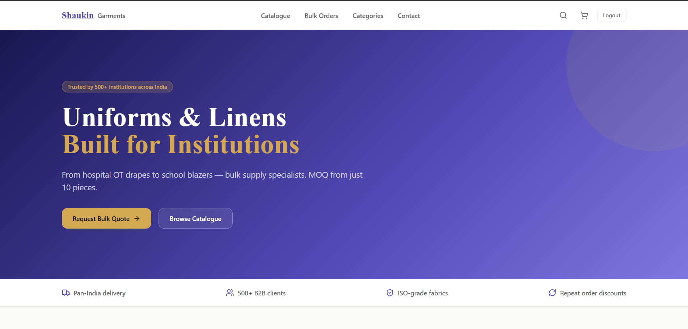
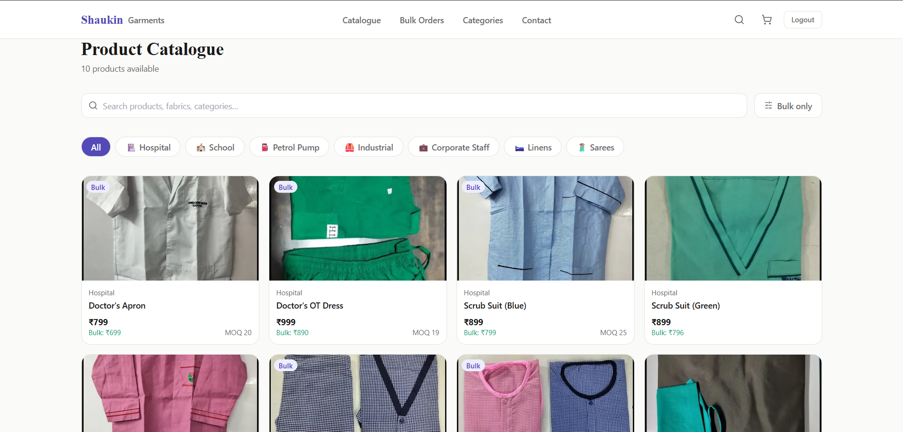
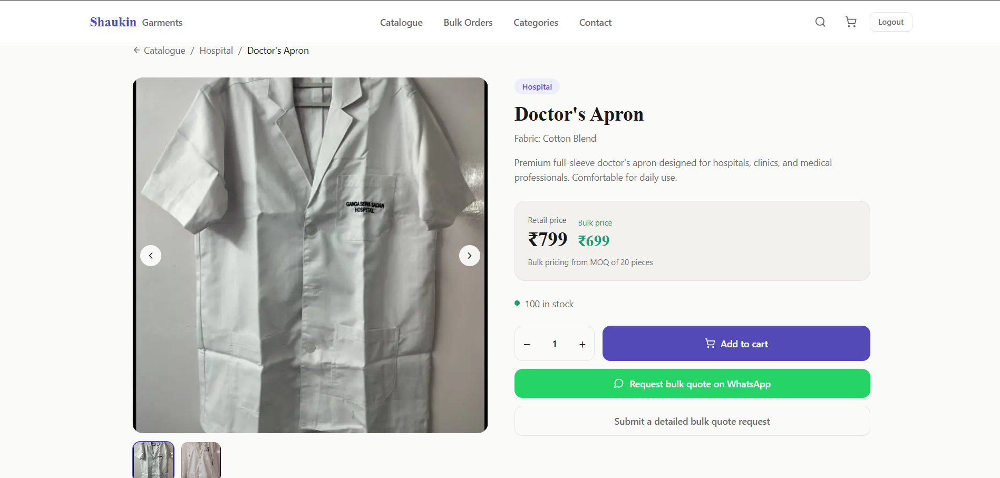
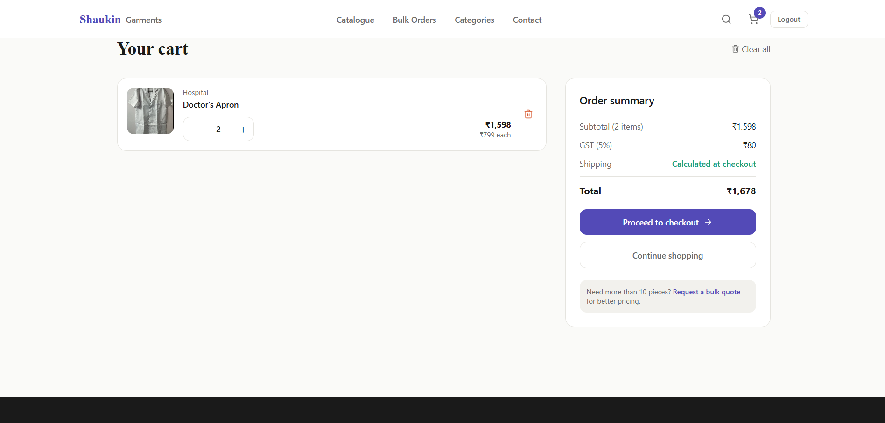
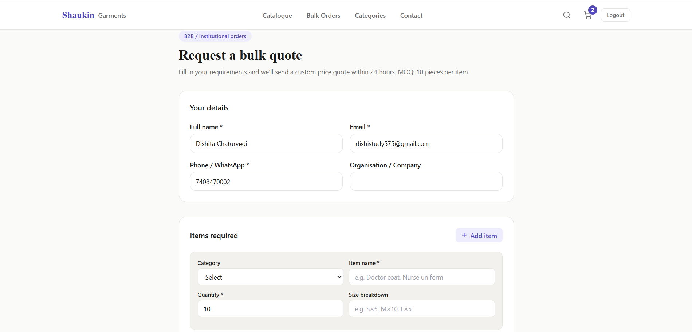
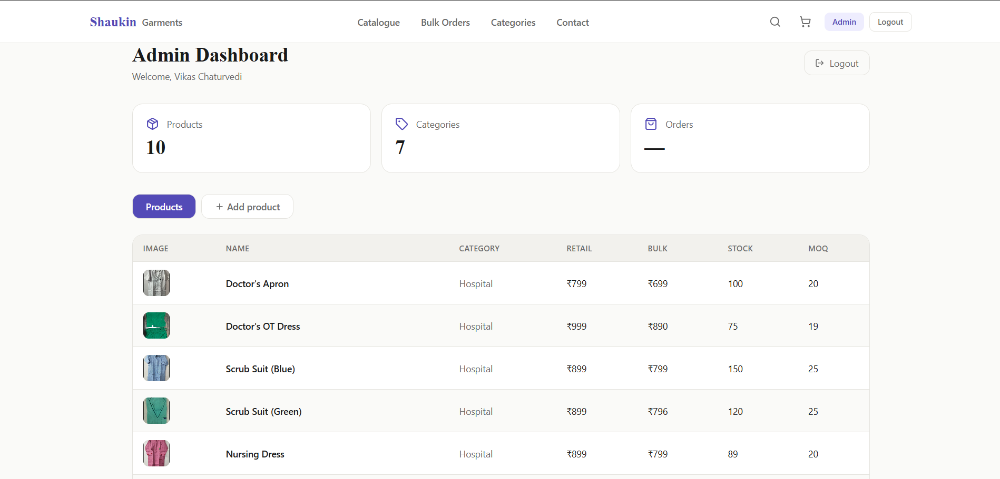
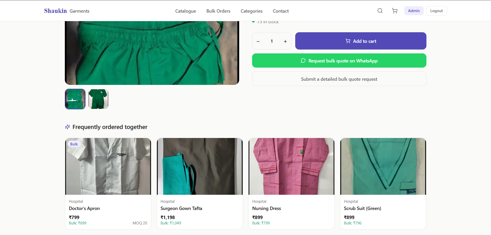
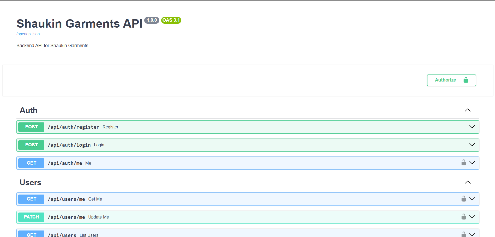
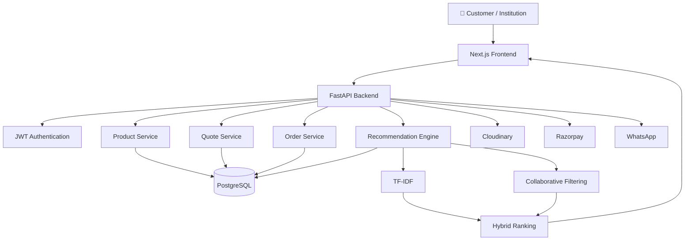
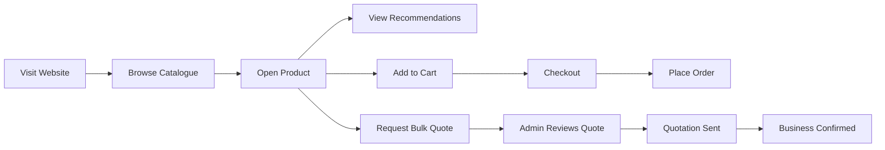

# 🏥 Shaukin Garments

### Modern B2B Commerce Platform for Institutional Uniform Procurement

A production-ready full-stack commerce platform built to digitize institutional uniform procurement through intelligent product discovery, streamlined bulk quotation workflows, and a cloud-native architecture.

---

# ✨ Overview

Shaukin Garments is a **production-grade B2B and retail e-commerce platform** designed specifically for institutional uniform suppliers.

Rather than adapting a generic online store for business procurement, the platform reimagines how organizations purchase uniforms, linens, and workwear at scale. Hospitals, schools, industries, petrol pumps, and corporate offices can browse products, submit detailed bulk quotations, and manage procurement through a streamlined digital workflow.

Built with a modern asynchronous backend, cloud-native deployment, and an intelligent recommendation engine, the platform transforms a traditionally manual ordering process into a scalable digital experience.

---

# 💡 Why Shaukin?

This project wasn't created as a portfolio exercise.

It originated from a real business challenge.

A family-run institutional garment business handled quotations, orders, and customer communication almost entirely through WhatsApp conversations, phone calls, and spreadsheets. As the business expanded, managing hundreds of products, bulk inquiries, pricing discussions, and inventory manually became increasingly difficult.

Instead of choosing a generic e-commerce solution, Shaukin Garments was built from the ground up around **institutional procurement workflows**, combining retail commerce with business-specific features such as quotation management, dual pricing, inventory administration, and intelligent product recommendations.

The result is a platform that not only serves customers more efficiently but also simplifies operations for the business itself.

---

# 🚀 What Makes Shaukin Different?

<table>

<tr>

<td width="50%">

## 🏢 Built Around Procurement

Designed for organizations—not just shoppers.

Institutional buyers can request quotations for multiple products, specify quantity distributions, include delivery information, and communicate custom requirements through a workflow tailored specifically for bulk purchasing.

</td>

<td width="50%">

## 🤖 Intelligent Product Discovery

Instead of static "related products", recommendations adapt based on product similarity and customer behaviour.

A hybrid recommendation engine combines content understanding with interaction history to surface products that are genuinely relevant.

</td>

</tr>

<tr>

<td>

## ⚡ Modern Backend

A fully asynchronous REST API powers the platform with secure authentication, role-based access control, scalable database interactions, and cloud-native deployment.

</td>

<td>

## ☁ Cloud Ready

The application is deployed across modern cloud services with automatic deployments, managed PostgreSQL, CDN-powered media delivery, and production-ready infrastructure.

</td>

</tr>

</table>

---

# 🌟 Core Capabilities

| 🛍 Commerce | 🏢 Procurement |
|:-----------:|:-------------:|
| Product Catalogue | Multi-item Quotations |
| Smart Search & Filters | Bulk Pricing |
| Shopping Cart | MOQ Support |
| Secure Checkout | Delivery Details |
| Product Variants | Organization Information |
| Responsive UI | WhatsApp Integration |

 

| ⚙ Administration | 🤖 Intelligence |
|:----------------:|:---------------:|
| Product Management | Hybrid Recommendation Engine |
| Inventory Control | TF-IDF Similarity |
| Quote Dashboard | Collaborative Filtering |
| Order Management | Behaviour Tracking |
| User Roles | Trending Products |
| Media Uploads | Frequently Bought Together |

---

# 📸 Product Tour

A quick walkthrough of the application.

## 🏠 Landing Experience

The homepage introduces institutional buyers to the platform through sector-based navigation, featured collections, and clear calls-to-action for both retail customers and bulk buyers.

---

## 🛍 Explore the Catalogue

Browse products using category filters, search, and bulk availability options.

---

## 📦 Product Details

Each product page provides detailed specifications, pricing for both retail and institutional purchases, stock information, image galleries, and intelligent recommendations.

---

## 🛒 Shopping Cart

Persistent shopping cart with quantity controls, automatic GST calculation, and seamless checkout.

---

## 🏢 Institutional Quotation Workflow

Organizations can request quotations containing multiple products, quantity breakdowns, delivery information, and custom requirements through a dedicated procurement workflow.

---

## ⚙ Administrative Dashboard

Administrators manage inventory, products, quotations, customer requests, and operational workflows from a centralized dashboard.

---

## 🤖 Intelligent Recommendations

The recommendation engine continuously learns from customer interactions to provide relevant product suggestions across the catalogue.

---

## 📚 Interactive API Documentation

Every endpoint is documented automatically through FastAPI's OpenAPI integration.

---

# 🏗 System Architecture

---

# 🔄 Customer Journey

---

# ⚡ At a Glance

| | |
|---|---|
| **Frontend** | Next.js 14 + TypeScript |
| **Backend** | FastAPI |
| **Database** | PostgreSQL (Supabase) |
| **Authentication** | JWT |
| **State Management** | Zustand + TanStack Query |
| **Machine Learning** | TF-IDF + Collaborative Filtering |
| **Media Storage** | Cloudinary |
| **Deployment** | Vercel + Render |

---

> 📌 **Continue to Part 2** for the technical architecture, technology stack, installation guide, API overview, and project structure.
