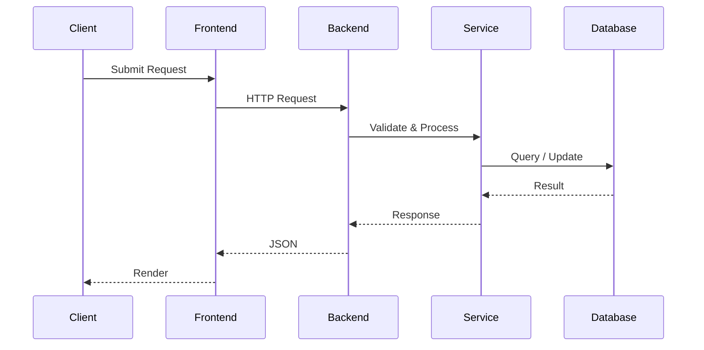

# API Documentation

## Overview

The Shaukin Garments backend exposes a RESTful API for product discovery, institutional procurement, user management, order processing, and administrative operations.

The API follows stateless communication principles and exchanges data exclusively in JSON format. Authentication is handled using JSON Web Tokens (JWT), and all protected endpoints require a valid bearer token.

Interactive API documentation is automatically generated through the OpenAPI specification and is available via the Swagger UI.

---

## Base URL

Development

```
http://localhost:8000
```

Production

```
https://YOUR_BACKEND_URL.onrender.com
```

Swagger UI

```
/docs
```

OpenAPI Schema

```
/openapi.json
```

---

# API Characteristics

| Property | Value |
|----------|-------|
| Protocol | HTTPS |
| Architecture | REST |
| Payload Format | JSON |
| Authentication | JWT Bearer Token |
| API Version | v1 |
| Documentation | OpenAPI 3.1 |
| Response Encoding | UTF-8 |

---

# API Conventions

## HTTP Methods

| Method | Purpose |
|---------|----------|
| GET | Retrieve resources |
| POST | Create resources |
| PATCH | Partial updates |
| PUT | Full replacement (reserved) |
| DELETE | Remove resources |

---

## Status Codes

| Code | Meaning |
|------|----------|
| 200 | Request completed successfully |
| 201 | Resource created |
| 204 | No content |
| 400 | Invalid request |
| 401 | Authentication required |
| 403 | Permission denied |
| 404 | Resource not found |
| 409 | Resource conflict |
| 422 | Validation failed |
| 500 | Internal server error |

---

# Authentication

The API uses JWT-based authentication.

After a successful login, the server returns an access token.

Every protected request must include:

```http
Authorization: Bearer <access_token>
```

Example

```http
GET /api/users/me HTTP/1.1
Authorization: Bearer eyJhbGci...
```

---

# Request Format

Example

```http
POST /api/auth/login
Content-Type: application/json
```

```json
{
    "email": "user@example.com",
    "password": "password123"
}
```

---

# Response Format

Successful responses return JSON.

Example

```json
{
    "id": 1,
    "name": "Doctor's Apron",
    "category": "Hospital",
    "retail_price": 799,
    "bulk_price": 699
}
```

---

# Error Responses

Errors follow a consistent JSON structure.

```json
{
    "detail": "Invalid credentials."
}
```

Validation example

```json
{
    "detail": [
        {
            "loc": [
                "body",
                "email"
            ],
            "msg": "field required",
            "type": "value_error.missing"
        }
    ]
}
```

---

# Authentication Endpoints

## Register

```
POST /api/auth/register
```

Creates a new customer account.

Authentication

```
Not Required
```

Request

```json
{
    "name": "John Doe",
    "email": "john@example.com",
    "password": "password123"
}
```

Response

```json
{
    "message": "User created successfully."
}
```

---

## Login

```
POST /api/auth/login
```

Authenticates a user and returns a JWT.

Authentication

```
Not Required
```

Response

```json
{
    "access_token": "...",
    "token_type": "bearer"
}
```

---

## Current User

```
GET /api/auth/me
```

Returns the authenticated user's profile.

Authentication

```
Required
```

---

# User Endpoints

## Current Profile

```
GET /api/users/me
```

Returns profile information.

---

## Update Profile

```
PATCH /api/users/me
```

Updates editable user fields.

---

## List Users

```
GET /api/users
```

Administrative endpoint.

Requires administrator privileges.

---

# Product Endpoints

## List Products

```
GET /api/products
```

Returns the product catalogue.

Supports:

- Search
- Category filtering
- Bulk-only filtering
- Pagination

Example

```
GET /api/products?category=Hospital&page=1
```

---

## Product Details

```
GET /api/products/{slug}
```

Returns complete product information.

Includes

- Images
- Pricing
- MOQ
- Stock
- Recommendations

---

## Create Product

```
POST /api/products
```

Administrative endpoint.

---

## Update Product

```
PATCH /api/products/{id}
```

Administrative endpoint.

---

## Delete Product

```
DELETE /api/products/{id}
```

Administrative endpoint.

---

# Category Endpoints

## List Categories

```
GET /api/categories
```

Returns available product categories.

---

# Cart Endpoints

## View Cart

```
GET /api/cart
```

Returns current cart contents.

---

## Add Item

```
POST /api/cart
```

Adds an item to the shopping cart.

---

## Update Quantity

```
PATCH /api/cart/{id}
```

Updates product quantity.

---

## Remove Item

```
DELETE /api/cart/{id}
```

Removes an item from the cart.

---

# Order Endpoints

## Create Order

```
POST /api/orders
```

Creates a retail order.

---

## Order History

```
GET /api/orders/my
```

Returns orders belonging to the authenticated user.

---

## Administrative Orders

```
GET /api/orders
```

Returns all customer orders.

Administrator only.

---

# Bulk Quotation Endpoints

## Submit Quote

```
POST /api/quotes
```

Creates a new institutional quotation request.

The request may contain multiple products, quantities, organization details, and delivery information.

---

## List Quotes

```
GET /api/quotes
```

Administrator endpoint.

---

## Quote Details

```
GET /api/quotes/{id}
```

Returns quotation information.

---

## Update Quote Status

```
PATCH /api/quotes/{id}
```

Updates quotation workflow status.

---

# Recommendation Endpoints

## Track Interaction

```
POST /api/recommendations/track
```

Stores customer interactions for future recommendation generation.

---

## Product Recommendations

```
GET /api/recommendations/product/{id}
```

Returns recommendations related to a product.

---

## Home Recommendations

```
GET /api/recommendations/home
```

Returns personalized homepage recommendations.

---

# Image Upload

Product images are uploaded through Cloudinary.

Supported formats

- JPEG
- PNG
- WebP

Uploaded assets are stored externally, while metadata is persisted in PostgreSQL.

---

# Pagination

Endpoints returning collections support pagination.

Example

```
GET /api/products?page=2&limit=20
```

Example response

```json
{
    "page": 2,
    "limit": 20,
    "total": 124,
    "items": []
}
```

---

# Validation

Request validation is performed using Pydantic schemas.

Validation includes:

- Required fields
- Type checking
- Length constraints
- Email validation
- Numeric constraints
- Enum validation

Invalid requests return HTTP 422.

---

# Authorization

Administrative endpoints require elevated privileges.

Protected resources include:

- Product management
- Category management
- Quote management
- Order administration
- User management

---

# API Workflow



---

# Versioning

The current implementation exposes a single API version.

Future versions should be introduced using URL versioning.

Example

```
/api/v1/products

/api/v2/products
```

to preserve backward compatibility.

---

# Future Enhancements

Planned improvements include:

- Cursor-based pagination
- API rate limiting
- Refresh tokens
- Request tracing
- API version negotiation
- OpenTelemetry integration
- Response caching
- Webhook support
