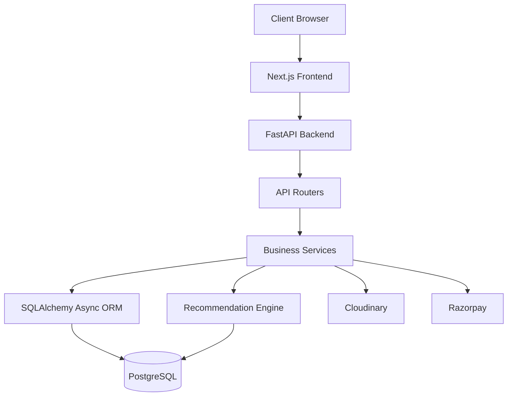
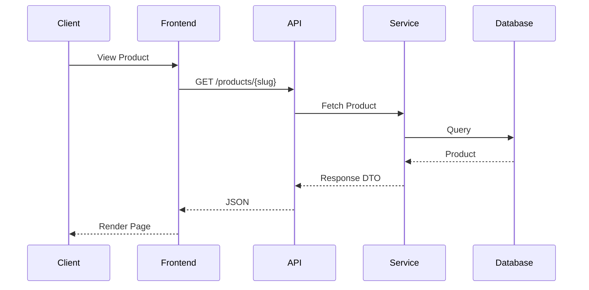
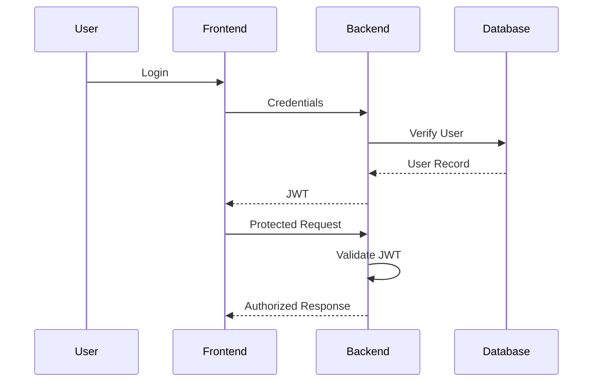

# System Architecture

## Overview

Shaukin Garments follows a layered client-server architecture composed of an independently deployed frontend application, a REST API backend, a relational database, and supporting cloud services.

The architecture separates presentation, business logic, persistence, recommendation logic, and third-party integrations into distinct layers. This separation reduces coupling between components while allowing each layer to evolve independently.

The system is organized around the following principles:

- Stateless API design
- Layered architecture
- Asynchronous request processing
- RESTful communication
- Relational data modeling
- Service-oriented backend organization

---

# High-Level Architecture



---

# Component Overview

| Component | Responsibility |
|------------|---------------|
| Frontend | User interface and client-side state |
| Backend | Business logic and API endpoints |
| Database | Persistent storage |
| Recommendation Engine | Product recommendation generation |
| Cloudinary | Product image storage |
| Razorpay | Payment processing |

---

# Layered Architecture

The system is divided into five logical layers.

```text
Presentation Layer

↓

API Layer

↓

Business Layer

↓

Persistence Layer

↓

Infrastructure Layer
```

Each layer has a single responsibility and communicates only with adjacent layers.

---

# Presentation Layer

The presentation layer is implemented using Next.js 14.

Responsibilities include:

- Rendering user interfaces
- Managing routing
- Client-side state
- Form validation
- Authentication state
- API communication

Business logic is intentionally excluded from this layer.

---

# API Layer

The API layer exposes REST endpoints consumed by the frontend.

Responsibilities include:

- Request validation
- Authentication
- Authorization
- Routing
- Response serialization
- Exception handling

All requests enter the application through this layer.

---

# Business Layer

Business logic is isolated from routing code.

Responsibilities include:

- Product management
- Cart operations
- Order processing
- Quote workflow
- Recommendation generation
- Inventory updates

The business layer does not directly expose HTTP concerns.

---

# Persistence Layer

Persistence is handled using SQLAlchemy Async ORM.

Responsibilities include:

- Database access
- Transactions
- Entity mapping
- Query execution

The persistence layer abstracts database operations from application logic.

---

# Infrastructure Layer

Infrastructure services include external providers required by the application.

Current integrations include:

- PostgreSQL
- Cloudinary
- Razorpay

These services remain isolated behind service interfaces.

---

# Request Lifecycle

The following sequence illustrates a typical request.



---

# Authentication Flow

Protected resources require a valid JWT.



---

# Data Flow

```mermaid
flowchart TD

Client

↓

Frontend

↓

REST API

↓

Business Services

↓

SQLAlchemy

↓

PostgreSQL

↓

Business Services

↓

JSON Response

↓

Frontend
```

---

# Recommendation Flow

The recommendation engine executes independently of request routing.

```mermaid
flowchart TD

Product

↓

Interaction Tracking

↓

Interaction Store

↓

Recommendation Service

↓

Content Similarity

+

Collaborative Filtering

↓

Hybrid Ranking

↓

Recommended Products
```

---

# Backend Organization

```text
app/

core/

db/

models/

routers/

schemas/

services/

ml/
```

Each package is responsible for a single subsystem.

Routing code remains independent of business logic.

---

# Design Characteristics

The architecture emphasizes:

- Stateless APIs
- Clear separation of concerns
- Asynchronous database operations
- Modular backend organization
- Independent frontend deployment
- Service-oriented design
- Production-ready cloud deployment

---

# Current Constraints

Current architecture assumptions include:

- Single backend instance
- Shared PostgreSQL database
- Synchronous recommendation generation
- Monolithic deployment model

These constraints simplify deployment while remaining suitable for the expected application scale.

Future architectural evolution is discussed in `deployment.md` and `performance.md`.
