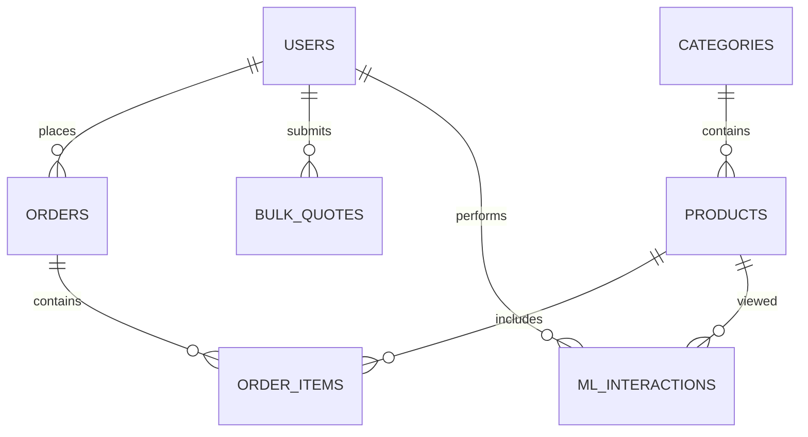
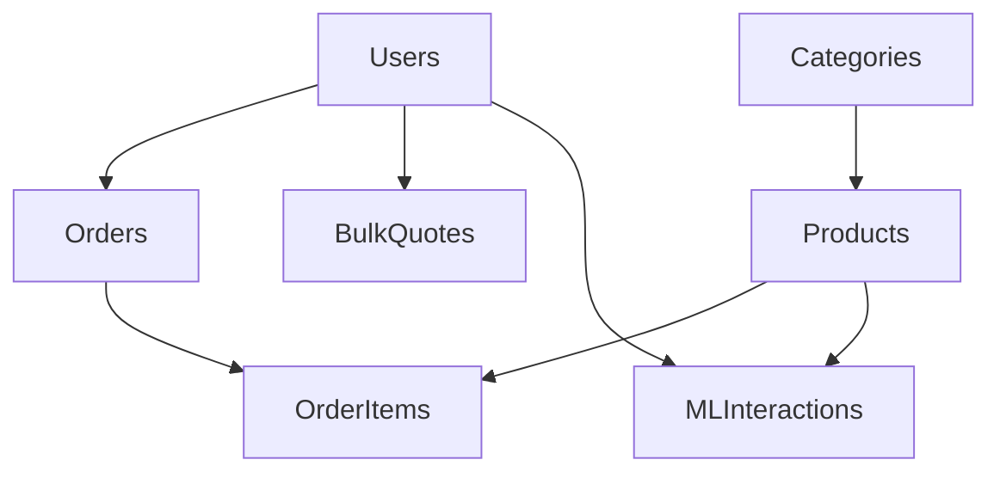

# Database Design

## Overview

Shaukin Garments uses PostgreSQL as its primary relational database. The schema is designed to support both retail commerce and institutional procurement while maintaining data integrity through normalized relationships.

The database stores user accounts, products, categories, quotations, orders, and interaction history used by the recommendation engine.

The design prioritizes consistency, extensibility, and efficient querying over denormalized storage.

---

# Database Objectives

The schema is designed to satisfy the following objectives:

- Maintain relational consistency
- Minimize data duplication
- Support institutional procurement workflows
- Enable efficient product search
- Record customer behaviour for recommendations
- Simplify administrative operations

---

# Database Engine

| Property | Value |
|----------|-------|
| Database | PostgreSQL |
| ORM | SQLAlchemy Async |
| Primary Keys | UUID / Integer |
| Foreign Keys | Enabled |
| Transactions | ACID |
| Indexing | B-Tree |

---

# Entity Relationship Diagram



---

# Schema Overview

| Table | Purpose |
|---------|---------|
| Users | Customer and administrator accounts |
| Categories | Product classification |
| Products | Product catalogue |
| Orders | Retail purchases |
| Order Items | Products belonging to an order |
| Bulk Quotes | Institutional quotation requests |
| ML Interactions | Behaviour tracking |

---

# Users

Stores registered customer and administrator accounts.

### Primary Fields

| Field | Type |
|-------|------|
| id | UUID |
| name | VARCHAR |
| email | VARCHAR |
| password_hash | TEXT |
| role | ENUM |
| created_at | TIMESTAMP |

Relationships

- One user can create many orders.
- One user can submit many quotations.
- One user can generate many interactions.

---

# Categories

Defines the available product categories.

Examples

- Hospital
- School
- Industrial
- Petrol Pump
- Corporate Staff
- Linens
- Sarees

### Fields

| Field | Type |
|-------|------|
| id | SERIAL |
| name | VARCHAR |

Relationship

One category contains many products.

---

# Products

Stores the complete product catalogue.

### Fields

| Field | Type |
|-------|------|
| id | UUID |
| category_id | INTEGER |
| name | VARCHAR |
| description | TEXT |
| retail_price | DECIMAL |
| bulk_price | DECIMAL |
| stock | INTEGER |
| minimum_order_quantity | INTEGER |
| image_url | TEXT |
| created_at | TIMESTAMP |

Relationships

- Belongs to one category
- Appears in many orders
- Appears in many quotations
- Generates many recommendation interactions

---

# Orders

Represents completed retail purchases.

### Fields

| Field | Type |
|-------|------|
| id | UUID |
| user_id | UUID |
| status | VARCHAR |
| total_amount | DECIMAL |
| created_at | TIMESTAMP |

Relationship

One order contains multiple products through the Order Items table.

---

# Order Items

Stores individual products belonging to an order.

### Fields

| Field | Type |
|-------|------|
| order_id | UUID |
| product_id | UUID |
| quantity | INTEGER |
| unit_price | DECIMAL |

---

# Bulk Quotes

Stores institutional procurement requests.

Unlike retail orders, quotations may include multiple requested products before pricing is finalized.

### Fields

| Field | Type |
|-------|------|
| id | UUID |
| user_id | UUID |
| organization | VARCHAR |
| phone | VARCHAR |
| delivery_location | TEXT |
| status | VARCHAR |
| created_at | TIMESTAMP |

Typical statuses include:

- Pending
- Reviewed
- Approved
- Rejected

---

# ML Interactions

Stores behavioural events used by the recommendation engine.

Examples include:

- Product View
- Product Click
- Cart Addition
- Purchase

### Fields

| Field | Type |
|-------|------|
| id | UUID |
| user_id | UUID |
| product_id | UUID |
| interaction_type | VARCHAR |
| created_at | TIMESTAMP |

---

# Relationships



---

# Data Lifecycle

## Product


---

## Order


---

## Bulk Quote

```mermaid
flowchart LR

Submitted

-->

Under Review

-->

Approved

-->

Converted to Order
```

---

# Constraints

The schema enforces the following constraints:

- Unique email addresses
- Positive pricing values
- Positive inventory counts
- Foreign key integrity
- Non-null required fields

These constraints prevent invalid application state from being persisted.

---

# Indexing Strategy

Indexes are created on frequently queried columns.

Recommended indexes include:

| Table | Indexed Columns |
|---------|----------------|
| Users | email |
| Products | category_id |
| Products | name |
| Orders | user_id |
| Bulk Quotes | status |
| ML Interactions | user_id, product_id |

---

# Normalization

The schema follows Third Normal Form (3NF).

Characteristics include:

- No repeating groups
- Minimal redundancy
- Atomic field values
- Foreign-key based relationships

Denormalization has intentionally been avoided in the current implementation to simplify maintenance.

---

# Transactions

Critical operations execute within database transactions.

Examples include:

- Order creation
- Inventory updates
- Bulk quotation submission
- User registration

This guarantees consistency in the presence of failures.

---

# Data Integrity

Integrity is maintained through:

- Foreign key constraints
- Unique constraints
- Transaction boundaries
- ORM validation
- Application-level validation

---

# Scalability Considerations

The current schema is designed for moderate application scale.

Potential future improvements include:

- Table partitioning
- Read replicas
- Materialized views
- Full-text search
- Redis caching
- Connection pooling

---

# Backup Strategy

Production deployments should include:

- Daily automated backups
- Point-in-time recovery
- WAL archiving
- Periodic restoration testing

---

# Future Schema Evolution

Potential additions include:

- Inventory history
- Payment transactions
- Shipment tracking
- Customer addresses
- Audit logs
- Notification history
- Review system
- Wishlist support
