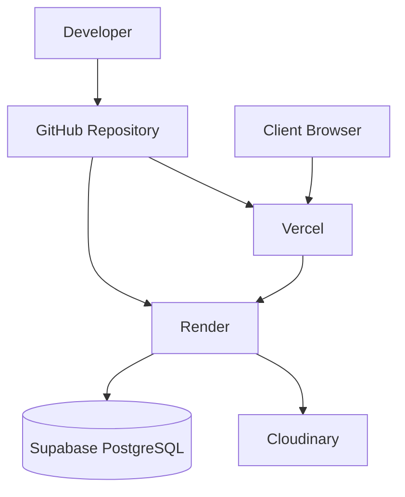
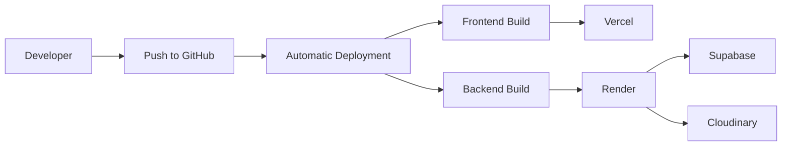

# Deployment

## Overview

Shaukin Garments is deployed as a distributed web application consisting of independently deployed frontend and backend services with managed cloud infrastructure.

The deployment architecture separates application logic, persistence, and media storage into dedicated services to simplify maintenance and scaling.

---

# Deployment Architecture



---

# Infrastructure Components

| Component | Platform |
|----------|----------|
| Frontend | Vercel |
| Backend | Render |
| Database | Supabase PostgreSQL |
| Media Storage | Cloudinary |
| Version Control | GitHub |

---

# Deployment Topology

```text
Client

↓

Vercel

↓

FastAPI

↓

PostgreSQL

↓

Cloudinary
```

---

# Frontend Deployment

The frontend is deployed independently from the backend.

Responsibilities include:

- UI rendering
- Routing
- State management
- API communication

Build command

```bash
npm run build
```

Production server

```bash
npm start
```

---

# Backend Deployment

The backend exposes REST APIs through FastAPI.

Responsibilities include:

- Authentication
- Product management
- Orders
- Quotations
- Recommendation engine

Production command

```bash
uvicorn main:app
```

---

# Database Deployment

Persistent application data is hosted using PostgreSQL.

The database stores:

- Users
- Products
- Categories
- Orders
- Quotations
- Recommendation interactions

All database access occurs through SQLAlchemy Async.

---

# Media Storage

Product images are stored externally using Cloudinary.

Benefits include:

- CDN delivery
- Image optimization
- Reduced application storage
- Lower backend bandwidth consumption

---

# Environment Configuration

Deployment requires environment-specific configuration.

Backend variables include:

```text
DATABASE_URL

SECRET_KEY

ALGORITHM

ACCESS_TOKEN_EXPIRE_MINUTES

CLOUDINARY_CLOUD_NAME

CLOUDINARY_API_KEY

CLOUDINARY_API_SECRET

RAZORPAY_KEY_ID

RAZORPAY_KEY_SECRET
```

Frontend variables include:

```text
NEXT_PUBLIC_API_URL

NEXT_PUBLIC_RAZORPAY_KEY
```

---

# Deployment Workflow



---

# Build Process

Frontend

1. Install dependencies
2. Compile application
3. Optimize assets
4. Deploy static bundle

Backend

1. Install Python dependencies
2. Load environment variables
3. Start FastAPI server
4. Establish database connection

---

# Release Process

Deployment follows a continuous delivery workflow.

1. Push changes to GitHub
2. Trigger cloud build
3. Execute build process
4. Deploy updated services
5. Verify application health

---

# Runtime Dependencies

External services required by the application include:

- PostgreSQL
- Cloudinary
- Razorpay

Application startup depends on successful initialization of these services.

---

# Health Checks

A healthy deployment satisfies the following conditions:

- Frontend accessible
- Backend reachable
- Database connection established
- Image uploads functional
- Authentication operational
- API documentation available

---

# Failure Scenarios

Possible deployment failures include:

| Failure | Impact |
|----------|--------|
| Database unavailable | API requests fail |
| Cloudinary unavailable | Image uploads fail |
| Invalid environment variables | Application startup failure |
| Backend unavailable | Frontend cannot retrieve data |
| Network failure | Service communication interrupted |

---

# Recovery Strategy

Recovery procedures include:

- Restart application services
- Validate environment variables
- Restore database connectivity
- Verify external integrations
- Redeploy latest stable version

---

# Deployment Constraints

Current deployment assumes:

- Single backend instance
- Single PostgreSQL database
- Managed cloud infrastructure
- Moderate request volume

These assumptions simplify operational complexity while remaining suitable for the current application scale.

---

# Scaling Considerations

Potential scaling strategies include:

- Horizontal backend scaling
- Database read replicas
- Redis caching
- CDN expansion
- Background workers
- Queue-based processing

---

# Monitoring

Recommended production monitoring includes:

- Application logs
- Request latency
- Error rates
- Database utilization
- Storage utilization
- API availability

---

# Backup Strategy

Production deployments should include:

- Daily database backups
- Periodic restoration testing
- Version-controlled application code
- Secure environment variable management

---

# Security Considerations

Deployment should ensure:

- HTTPS enforcement
- Secure environment variables
- Restricted database access
- Least-privilege service accounts
- Regular dependency updates

---

# Future Improvements

Potential infrastructure enhancements include:

- Docker
- Docker Compose
- GitHub Actions
- Kubernetes
- Terraform
- Automated database migrations
- Blue-Green deployments
- Canary releases

---

# Summary

The deployment architecture separates application concerns across independently deployable services while relying on managed cloud infrastructure for persistence and media storage. This approach reduces operational overhead, supports independent component updates, and provides a straightforward path for future scalability.
