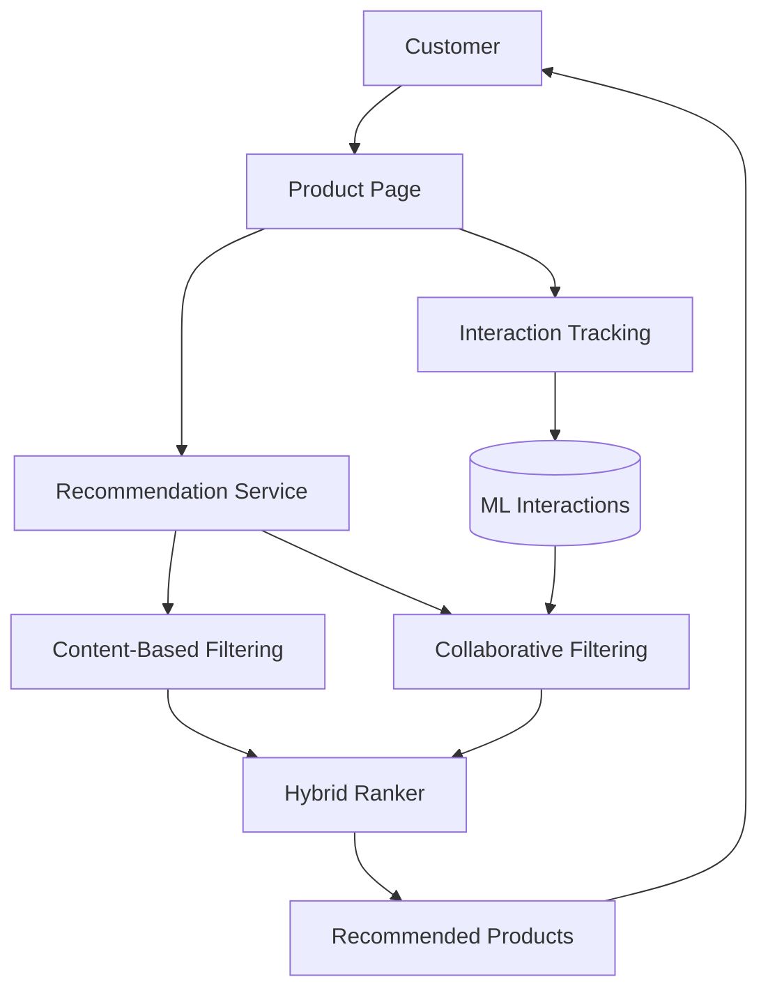
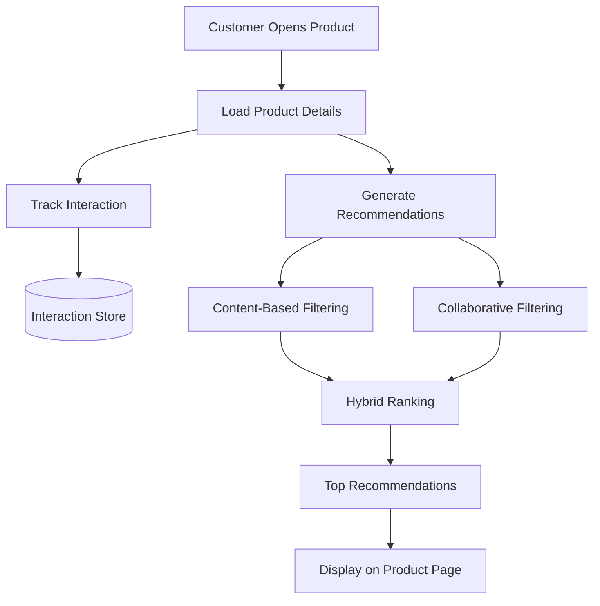
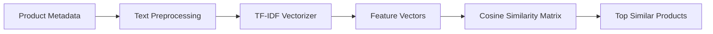
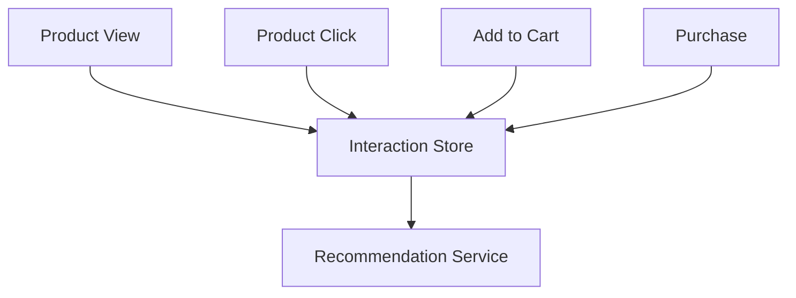
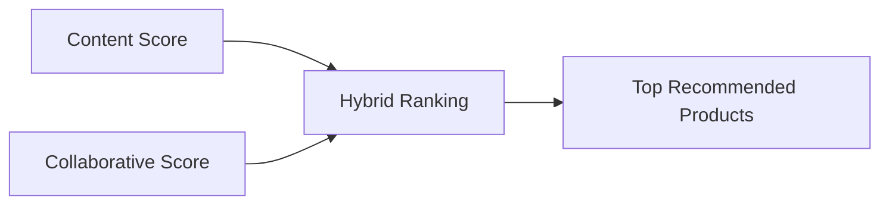
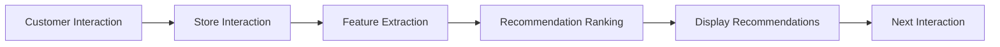

# Recommendation Engine

## Overview

The recommendation engine provides personalized product suggestions by combining content-based filtering with collaborative filtering. The objective is to improve product discovery, increase customer engagement, and surface relevant items based on both product characteristics and user interactions.

Unlike static "Related Products" sections, recommendations are generated dynamically using product metadata and historical interaction data.

---

# Objectives

The recommendation system is designed to:

- Improve product discovery
- Increase cross-selling opportunities
- Personalize the shopping experience
- Utilize behavioural data for ranking
- Support both anonymous and authenticated users

---

# System Architecture

---

# Recommendation Pipeline

---

# Recommendation Strategies

The recommendation engine combines two independent approaches.

1. Content-Based Filtering
2. Collaborative Filtering

Each technique contributes independently before the final ranking stage.

---

# Content-Based Filtering

Content-based filtering recommends products based on their attributes rather than customer behaviour.

Product descriptions, categories, tags, and metadata are transformed into numerical vectors using TF-IDF.

Similarity between products is computed using cosine similarity.

Typical product attributes include:

- Category
- Description
- Material
- Department
- Product Name

This approach performs well for newly added products where interaction history is limited.

---

## Content Similarity Workflow

---

# Collaborative Filtering

Collaborative filtering utilizes historical customer behaviour.

Instead of comparing products directly, it identifies relationships through interaction patterns.

Examples of tracked events include:

- Product View
- Product Click
- Cart Addition
- Purchase

Products frequently interacted with together receive higher recommendation scores.

---

# Behaviour Tracking

Every customer interaction contributes to the recommendation dataset.

---

# Hybrid Ranking

Neither content similarity nor collaborative filtering is sufficient independently.

The recommendation engine combines both scores into a unified ranking process.

Advantages include:

- Better personalization
- Reduced cold-start impact
- Higher recommendation diversity
- Improved relevance

---

# Recommendation Flow

---

# Interaction Model

Each interaction contributes to recommendation quality.

| Interaction | Relative Importance |
|-------------|--------------------:|
| Product View | Low |
| Product Click | Medium |
| Add to Cart | High |
| Purchase | Very High |

The weighting strategy prioritizes stronger purchase intent.

---

# Cold Start Handling

Cold-start situations occur when sufficient interaction history is unavailable.

The current implementation addresses this using:

- Product metadata
- Category similarity
- Recently added products
- Popular products

This allows recommendations to remain meaningful for new users and new products.

---

# Recommendation Lifecycle

---

# Computational Flow

Recommendation generation consists of the following stages:

1. Load product metadata
2. Retrieve interaction history
3. Generate TF-IDF vectors
4. Compute cosine similarity
5. Compute collaborative scores
6. Merge rankings
7. Return Top-N products

---

# Performance Characteristics

| Operation | Complexity |
|-----------|-----------:|
| TF-IDF Vectorization | O(n × m) |
| Cosine Similarity | O(n²) |
| Interaction Lookup | O(log n) (indexed) |
| Ranking | O(n log n) |

Where:

- n = number of products
- m = vocabulary size

---

# Current Limitations

The current implementation assumes:

- A moderate product catalogue
- Limited interaction history
- Batch recommendation generation
- Single recommendation model

As the catalogue grows, recommendation latency may increase.

---

# Future Enhancements

Potential improvements include:

- Matrix Factorization
- Approximate Nearest Neighbour Search
- Sentence Transformers
- Vector Database Integration
- Redis Recommendation Cache
- Incremental TF-IDF Updates
- Learning-to-Rank Models
- Real-time Event Streaming

---

# Summary

The recommendation engine combines content similarity with behavioural analysis to generate relevant product suggestions while remaining computationally efficient for the current scale of the application.

The modular architecture allows additional recommendation strategies to be incorporated without affecting existing API endpoints or frontend components.
